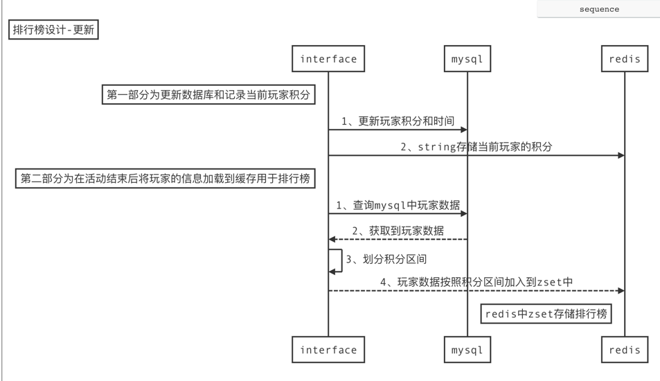
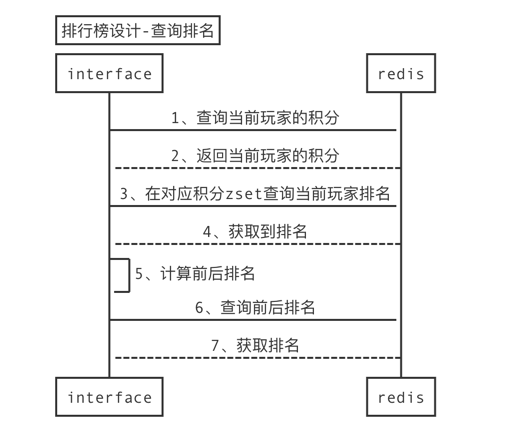

你开发了一个游戏，日活跃用户在10万人以上。请设计一个活动排行榜系统。 
- 在每月活动中，玩家得到的活动总分为 0 到 10000 之间的整数。
- 在每月活动结束之后，需要依据这一活动总分，从高到低为玩家建立排行榜。 
- 如果多位玩家分数相同，则按得到指定分数顺序排序，先得到的玩家排在前面。 
- 系统提供玩家名次查询接口，玩家能够查询自己名次前后10位玩家的分数和名次。 
- 请使用 UML 图或线框图表达设计，关键算法可使用流程图或伪代码表达

# 时序图
```sequence
Title: 排行榜设计-更新
Note left of interface: 第一部分为更新数据库和记录当前玩家积分
interface->mysql: 1、更新玩家积分和时间
interface->redis: 2、string存储当前玩家的积分
Note left of interface: 第二部分为在活动结束后将玩家的信息加载到缓存用于排行榜
interface->mysql: 1、查询mysql中玩家数据
mysql --> interface: 2、获取到玩家数据
interface -> interface: 3、划分积分区间
interface --> redis: 4、玩家数据按照积分区间加入到zset中
Note left of redis: redis中zset存储排行榜
```

```sequence
Title: 排行榜设计-查询排名
interface->redis: 1、查询当前玩家的积分
redis-->interface: 2、返回当前玩家的积分
interface->redis: 3、在对应积分zset查询当前玩家排名
redis-->interface: 4、获取到排名
interface->interface: 5、计算前后排名
interface->redis: 6、查询前后排名
redis-->interface: 7、获取排名
```

## mysql表
表名：player
| 字段名 |  column |
|--| ----  |
| id | 主键id |
| 姓名 | name |
| 积分 | score |
| 更新时间 | time |
create index idx_score on player(score)
#### 更新
insert into player values(id,'namer',1000,1657431581);
#### 查询
select * from player where score = 100 order by time asc limit 100; 

## redis
使用redis的zset存储。按照积分区间拆成多个key存储在zset中，score为时间戳。
- key: player.100 表示积分在[0,100),10000积分可以分为100个key，最后一个key存储[9900，10000\]
- score：时间戳

用string存储当前用户的积分
- key: id 当前玩家
- value：积分数
#### 更新
```
SET id points

ZADD player.points timestamp id // id为数据库中的主键id
```
#### 查询
```
// 1.查询当前用户的积分
int points = GET current.player;

// 2.查询当前用户排名
int rank = ZRANK player.points id;

// 3.查询前后十名
int after = rank + 10;
int pre = rank - 10;
List list = ZRANGE player.points pre after WITHSCORES
if ((after - pre + 1) == list.size()) { // 如果当前分段可以查到所有需要的数据
    return list;
}

// 4.如果查询人数不足21个，继续执行下面操作
// 记录正在查询哪个分数区间
int prePoint = points;
int afterPoint = points;
// 记录人数差值
int preDiff = rank - pre;
int afterDiff = after - rank;
while (preDiff < 10 && prePoint > 0) { // 排名之前的不足十个，并且前面还有未查的分数，继续查前一个分数
    List preList = ZRANGE player.prePoint preDiff 100 WITHSCORES; // 查询当前分段的[preDiff,100]
    list.addALL(preList);
    preDiff+=preList.size();
    prePoint-=100;
}

while (afterDiff < 10 && afterPoint < 10000) { // 排名之后的不足十个，并且后面还有未查的分数
    List afterList = ZRANGE player.afterPoint 0 afterDiff WITHSCORES; // 查询当前分段的[0,afterDiff]
    list.addALL(afterList);
    afterDiff+=afterList.size();
    afterPoint+=100;
}

return list;
```